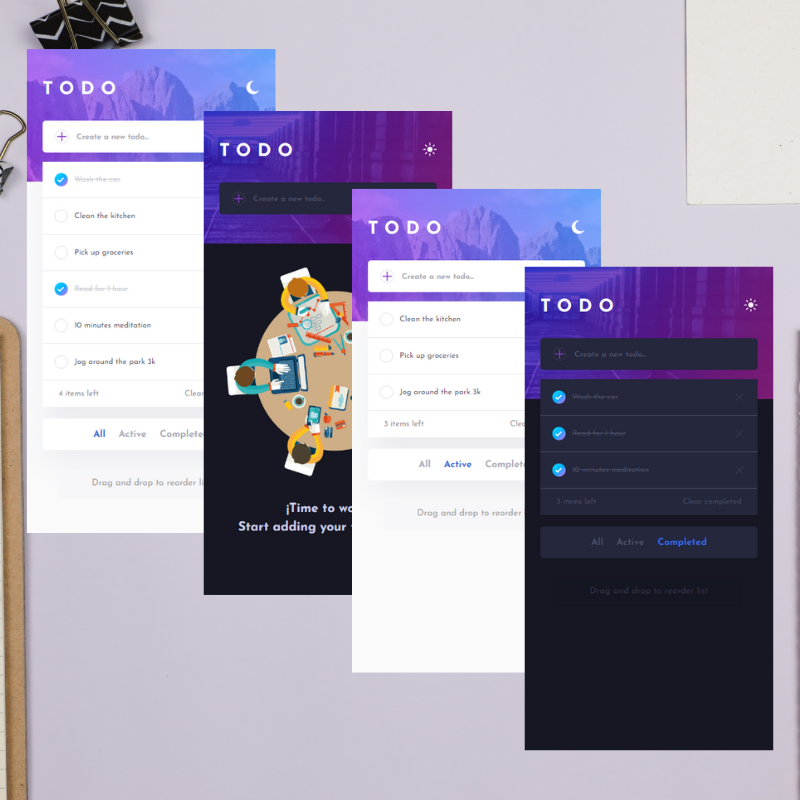
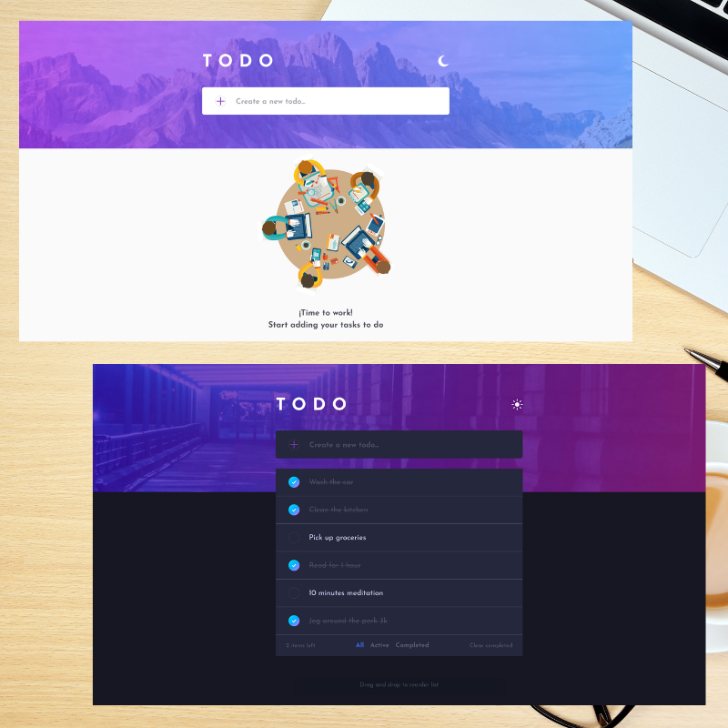

# Todo Web App

This is a solution to the [Todo app challenge on Frontend Mentor](https://www.frontendmentor.io/challenges/todo-app-Su1_KokOW).

## Table of contents

- [Overview](#overview)
  - [The challenge](#the-challenge)
  - [Screenshot](#screenshot)
  - [Links](#links)
- [My process](#my-process)
  - [Built with](#built-with)
  - [Useful resources](#useful-resources)
- [Author](#author)

## Overview

### The challenge

Users should be able to:

- View the optimal layout for the app depending on their device's screen size
- See hover states for all interactive elements on the page
- Add new todos to the list
- Mark todos as complete
- Delete todos from the list
- Filter by all/active/complete todos
- Clear all completed todos
- Toggle light and dark mode
- Drag and drop to reorder items on the list
- Save progress at local storage

### Screenshot

***Mobile***

 

***Desktop***

 

### Links

- Live Site URL: [Todo web app](https://hugoriveros18.github.io/todo-app/)

## My process

### Built with

- Semantic HTML5 markup
- CSS custom properties
- Flexbox
- Mobile-first workflow
- [React](https://reactjs.org/) - JS library

### Useful resources

- [Developer Mozilla](https://developer.mozilla.org/es/docs/Web/CSS) - As usual, one of the best documentation around web development, in this case, helped me especially with CSS styles that I need to make my page look great.
- [W3 Schools](https://www.w3schools.com/) - Excellent web development documentation, explaining with great clarity the main technologies: HTML, CSS, JavaScript.
- [Stack Overflow](https://stackoverflow.com/) - In general, it is a very complete page that allows you to quickly resolve doubts thanks to the community, considerably reducing the programming time of the page.
- [React Beautiful dnd](https://github.com/atlassian/react-beautiful-dnd) - Atlassian library to create excelent drag and drop animation for horizontal and vertical lists, with flexible items sizes.

## Author

- Frontend Mentor - [@hugoriveros18](https://www.frontendmentor.io/profile/hugoriveros18)
- Twitter - [@HugoRiverosF18](https://www.twitter.com/HugoRiverosF18)
- LinkedIN - [Hugo Felipe Riveros Fajardo](https://www.linkedin.com/in/hugo-felipe-riveros-fajardo-bb840292)
